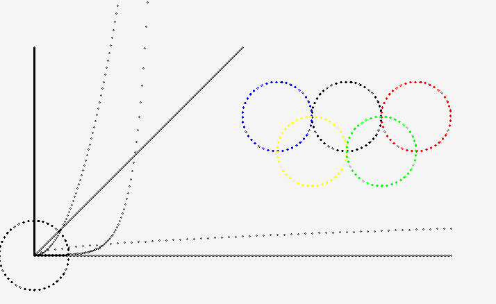

## 
建议绘图语言编译器

### 介绍：
该程序为一个简单绘图语言的编译器，该编译器接受简单绘图语言源程序，生成对应图案。

### 实现方法：
该编译器首先读取所有的绘图语言源程序，然后逐条将源码传递到词法分析部分，经过词法分析后，传递符号表到语法分析，经过语法分析传递完整句子到语义分析部分，经过语义分析，保存颜色参数和点的坐标，继续下一条源码分析。当源码分析完成之后，将颜色参数和点坐标序列传递到绘图方法中，实现绘图。

### 运行环境：
<ul>
<li>Ubuntu 16.04</li>
<li>IDEA 2017.2.2</li>
<li>java-1.8.0-openjdk-amd64</li>
</ul>

### 绘图示例：
#### 源程序：
> ROT IS 0;  
> ORIGIN IS (50,400);  
> SCALE IS (2,1);  
> FOR T FROM 0 TO 300 STEP 1 DRAW(T,0);  
> //横坐标  
> FOR T FROM 0 TO 300 STEP 1 DRAW(0,-T);  
> --纵坐标  
> SCALE IS (1,1);  
> FOR T FROM 0 TO 300 STEP 1 DRAW(T,-T);  
> SCALE IS (20,0.1);  
> FOR T FROM 0 TO 50 STEP 0.1 DRAW(T,-EXP(T));  
> SCALE IS (2,0.1);  
> FOR T FROM 0 TO 100 STEP 1 DRAW(T,-(T*T));  
> SCALE IS (10,5);  
> FOR T FROM 0 TO 60 STEP 1 DRAW(T,-SQRT(T));  
> origin is (50,400);  
> scale is (50,50);  
> for t from 0 to 100 step 1 draw(sin(t),cos(t));  
>  
> setcolor(blue);  
> origin is (400,200);  
> scale is (50,50);  
> for t from 0 to 100 step 1 draw(sin(t),cos(t));  
> setcolor(black);  
> origin is (500,200);  
> scale is (50,50);  
> for t from 0 to 100 step 1 draw(sin(t),cos(t));  
> setcolor(red);  
> origin is (600,200);  
> scale is (50,50);  
> for t from 0 to 100 step 1 draw(sin(t),cos(t));  
> setcolor(yellow);  
> origin is (450,250);  
> scale is (50,50);  
> for t from 0 to 100 step 1 draw(sin(t),cos(t));  
> setcolor(green);  
> origin is (550,250);  
> scale is (50,50);  
> for t from 0 to 100 step 1 draw(sin(t),cos(t));  

#### 绘图结果：

