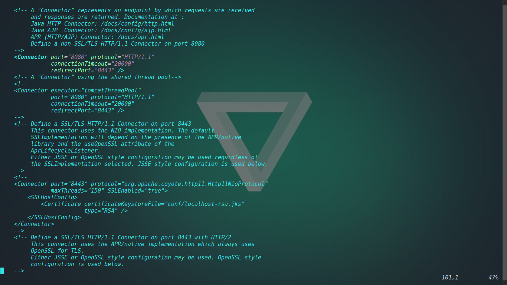

## 在Ubuntu上安装tomcat9

首先你需要下载JDK

* 然后在tomcat官网下载Tomcat9,下载core tar.gz 文件
> 官网地址 http://tomcat.apache.org/download-90.cgi
> 用命令行下载 `curl -O http://apache.mirrors.ionfish.org/tomcat/tomcat-9/v9.0.0.M26/bin/apache-tomcat-9.0.0.M26.tar.gz`

* 然后执行命令`tar -zxvf apache-tomcat-9.0.0.M26.tar.gz -C /usr/local/Developer/`解压文件
* 添加环境变量，打开/etc/profile，加入该环境变量
> 例：`sudo vim /etc/profile`  
> 在文档中添加`export TOMCAT_HOME=/usr/local/DeveloperTools/apache-tomcat-9.0.0.M26`

* 进入tomcat安装文件，如上应进入/usr/local/Developer/apache-tomcat-9.0.0.M26
> 即：`cd /usr/local/Developer/apache-tomcat-9.0.0.M26`

* 启动tomcat
> 例: `sudo ./bin/startup.sh`
> 如果出现 Tomcat started 即为成功

打开浏览器，输入地址 localhost:8080 即可进入tomcat页面  
如果没有出现相应界面，尝试`sudo ufw 8080`，打开8080端口  
进入/usr/local/Developer/apache-tomcat-9.0.0.M26 使用`sudo ./bin/shutdown.sh`关闭tomcat  
使用`sudo netstat -anp | grep port`（port为端口号）获得该端口对应的PID  
使用`sudo kill PID`关闭该端口  
> 例：执行`sudo netstat -anp | grep 8080`查看结果有12626/java
> 则执行`sudo kill 12626`来关闭该端口

### 改变Tomcat端口
打开Tomcat安装目录下的conf文件夹下的servlet.xml文件，将下图中的8080直接改为你想要设置的端口号即可。  

