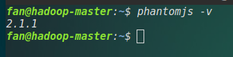
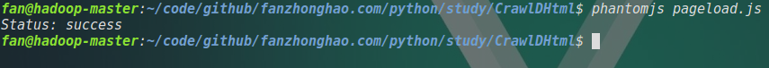
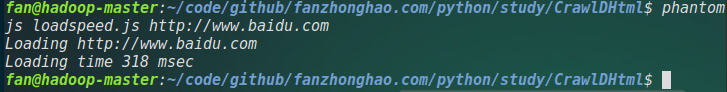
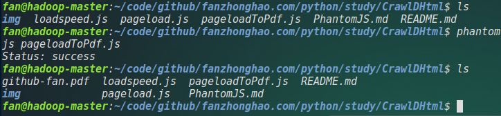
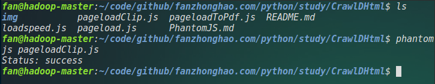
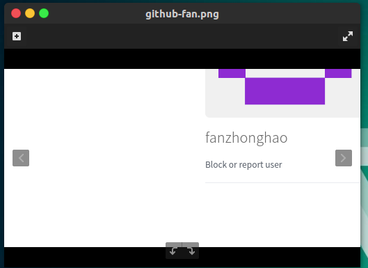
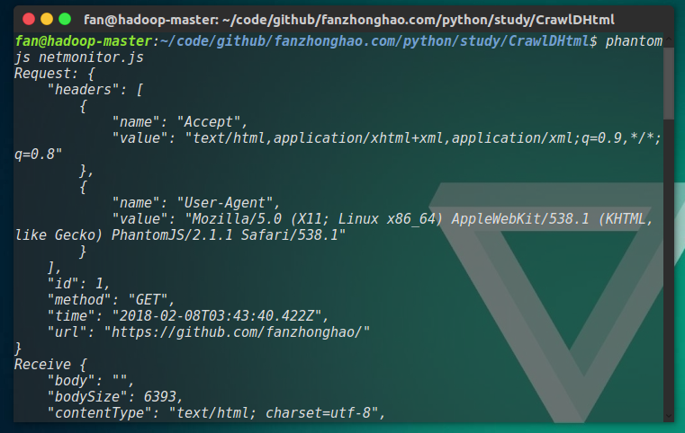
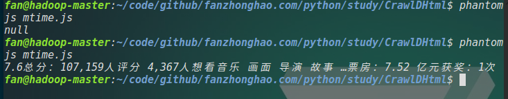

# PhantomJS
PhantomJS是一个基于WebKit的服务器端JavaScript API。  
在Ubuntu 16.04 上测试。  
安装PhantomJS：  
直接在命令行中使用：  
> sudo apt-get install phantomjs

来进行安装。  
查看版本：  
  
下面进行一下测试：  

	var page = require('webpage').create();
	page.open('https://github.com/fanzhonghao/',function(status){
        console.log("Status: " + status);
        if(status === "success"){
                page.render('github-fan.png');
        }
        phantom.exit();
	});

将以上代码保存为：pageload.js，该代码用来截图目标网页。  
运行 pageload.js:  
  
查看网页加载速度：  

	var page = require('webpage').create(),
    	system = require('system'),
    	t,address;
	if (system.args.length === 1) {
  		console.log('Usage: loadspeed.js <some URL>');
  		phantom.exit();
	}
	t = Date.now();
	address = system.args[1];
	page.open(address,function (status) {
  		if (status !== 'success') {
    		console.log('Fail to load the address');
  		}else {
    		t = Date.now() - t;
    		console.log('Loading ' + system.args[1]);
    		console.log('Loading time ' + t + ' msec');
  		}
  	phantom.exit();
	})

以上代码保存为 loadspeed.js ,运行结果如下：  
  

PhantomJs可以将网页保存为一张图片，可以为png,jpg,gif和pdf格式。  
eg:  

	var page = require('webpage').create();
	page.open('https://github.com/fanzhonghao/',function(status){
		console.log("Status: " + status);
		if(status === "success"){
			page.render('github-fan.pdf');
		}
		phantom.exit();
	});

保存为pageloadToPdf.js,运行结果如下：  
  
同时PhantomJS也可以对图片进行缩放和裁剪：  

	var page = require('webpage').create();
	page.viewportSize = {width:1024,height:768};//浏览器缩放
	page.clipRect = {top:256,left:256,width:512,height:256}//确定裁剪窗口
	page.open('https://github.com/fanzhonghao/',function(status){
		console.log("Status: " + status);
		if(status === "success"){
			page.render('github-fan.png');
		}
		phantom.exit();
	});

保存为pageloadClip.js,运行结果如下：  
  
  
网络监控：  

	var url = "https://github.com/fanzhonghao/";
	var page = require('webpage').create();
	page.onResourceRequested = function (request) {
  		console.log('Request: ' + JSON.stringify(request,undefined,4));
	};
	page.onResourceReceived = function (response) {
  		console.log('Receive ' + JSON.stringify(response,undefined,4));
	};
	page.open(url);
保存为netmonitors.js,运行结果如图：  
  
以上请求和响应均以JSON格式显示。  

用PhantomJS查看 MTime 影评信息：  

	var page = require('webpage').create();
	page.settings.userAgent = 'Mozilla/5.0 (Windows NT 6.1;WOW64; rv:49.0) 			Gecko/20100101 Firfox/49.0';
	page.open('http://movie.mtime.com/108737/',function(status) {
  	if (status !== 'success') {
    	console.log('Unable to access network');
  	}else {
    	var u = page.evaluate(function() {
      	return document.getElementById('ratingRegion').textContent;
    });
    console.log(u);
  	}
  	phantom.exit();
	});

其中，设置userAgent是为了让服务器认为是从浏览器发出的请求，evaluate方法返回一个对象，该对象不能包含函数。  
运行结果：  
  
如上，有时会返回空。  
关于文件：  
使用 fs 模块，常用的有四种方法。  
1. touch：  
> 用于创建一个空文件  
> eg: require('fs').touch('test.txt');  

2. exists:
> 用于判断文件是否存在。  
> eg:require('fs').exists('test.txt')  
> 返回一个布尔值。  

3. read:
> 用于读文件：  
> eg:require('fs').write(path,content,'w');  
> 将内容content写入path中  

4. write:
> 用于写文件：  
> eg:require('fs').write(path,content,'w');

