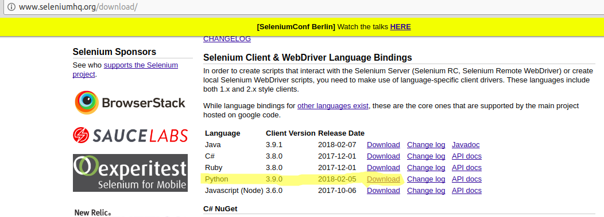

# Selenium
实验系统：Ubuntu 16.04
Selenium是一个自动化测试工具，支持各种浏览器，同时通过各种浏览器驱动，可以对浏览器进行控制。  
安装方法：  
在<a href = "http://www.seleniumhq.org">官网</a>下载Python版本。  
  
然后需要下载即将使用的浏览器的对应的geckdriver。  
  
将下载下来的geckdriver安装到 /usr/bin下即可。  
	# -*- coding:utf-8 -*-
	from selenium import webdriver
	from selenium.webdriver.common.keys import Keys
	import time
	driver = webdriver.Firefox()
	driver.get('http://www.baidu.com')
	assert u"百度" in driver.title
	elem = driver.find_element_by_name("wd")
	elem.clear()
	elem.send_keys(u'网络爬虫')
	elem.send_keys(Keys.RETURN)
	time.sleep(3)
	assert u"网络爬虫." not in driver.page_source
	time.sleep(1000)
	driver.close()

运行后会直接百度搜索网络爬虫。  
代码分析：  
> 首先webdriver.Firefox()获得浏览器驱动，然后使用get方法打开百度首页，判断标题中是否含有百度字样，通过名称"wd"获取输入框，通过send_keys()将网络爬虫填入输入框，延时3s,判断搜索页面是否含有网络爬虫字样，休眠，关闭。  

通过通用方法和非通用方法可以选中页面元素。  
通用方法：find_element(s)(By.\*,'url')  
非通用方法：find_element(s)_by_\*  
“\*”可选择的范围为{id,name,xpath,link_text,partial_link,tag_name,class_name,css_selector}  
使用 driver.switch_to_window("windowName") 来切换窗口。  
使用 driver.switch_to_frame("frameName") 来切换页面。  
使用 alert = driver.switch_to_alert()获取弹框对象。  
使用 alert.dismiss() 来关闭弹框。  

<b>等待</b>  
可以设置显式等待和隐式等待。  
显示等待是条件触发式等待，可以指定某一条件设置等待，或者设置超时时间，如果超时元素依旧没有被加载，就会抛出异常。  
	# -*- coding:utf-8 -*-
	from selenium import webdriver
	from selenium.webdriver.common.by import By
	from selenium.webdriver.support.ui import WebDriverWait
	from selenium.webdriver.support import expected_conditions
	driver = webdriver.Firefox()
	driver.get("https://github.com/fanzhonghao/")
	try:
    	element = WebDriverWait(driver,10).until(
        	expected_conditions.title_contains("fanzhonghao")
    	)
    	print 'find it'
	except Exception as e:
    	print(e)
	finally:
    	driver.close()
代码分析：  
> WebDriverWait()中，设置等待超时时间为10s，WebDriverWait（）会每500ms检测一下元素是否存在。  
> 在expected_conditions中的条件有：
> title_is,title_contains,presence_of_element_located,visibility_of_element_located,visibility_of,presence_of_all_elements_located,text_to_be_present_in_element,text_to_be_present_in_value,frame_to_be_available_and_and_switch_to_it,invisibility_of_element_located,element_to_be_clickable,staleness_of,element_to_be_selected,selement_located_to_beselected,element_selection_State_to_be,element_located_selection_state_to_be,alert_is_present.  

隐式等待是在尝试发现某个元素的时候，如果没能立刻发现，就等待固定长度的时间，类似socket超时，默认设置是0s。  
